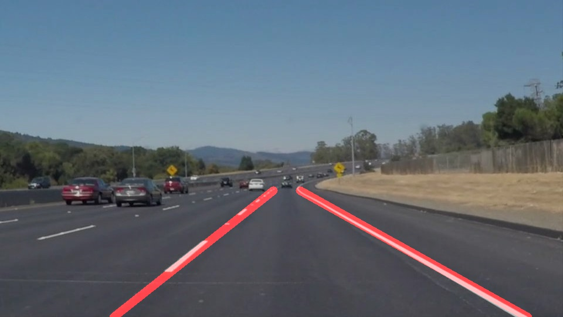
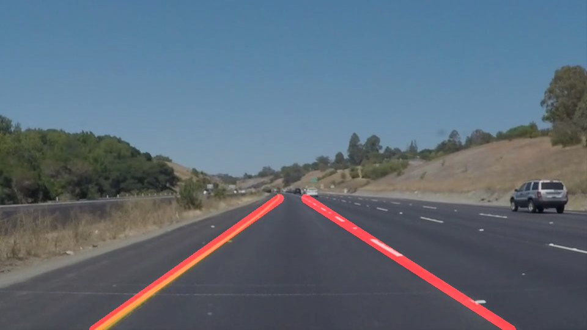

# Finding Lane Lines on the Road

## The goals / steps of this project are the following:
### Make a pipeline that finds lane lines on the road
### Reflect on your work in a written report

## Reflection
### 1. Describe your pipeline. As part of the description, explain how you modified the draw_lines() function.

My pipeline consisted of 5 steps. 
First, I converted the images to grayscale, 
Second, I applied Gaussian_blur to it,
Third, I extracted Canny_edges with thrshhold values (low:80, high 160)
Fourth, I masked to those edges with the region of interest,
Finally, I found hough_lines from it

In order to draw a single line on the left and right lanes, I modified the draw_lines() function.
First, I sperated the left lines from the right one using gradient.
And, I found the minimum bounding rectangle of each section, and draw the diagonal of it 

Here are some output images of my pipeline

### 2. Identify potential shortcomings with your current pipeline
One potential shortcoming would be what would happen when we meet a highly curved lane. That is basically my draw_lines_modified() function is written under the assumption of the output lane would be a linear line. 

### 3. Suggest possible improvements to your pipeline

A possible improvement would be to implement draw_line function by connecting the short line segments and smoothing the curvature difference of those.

